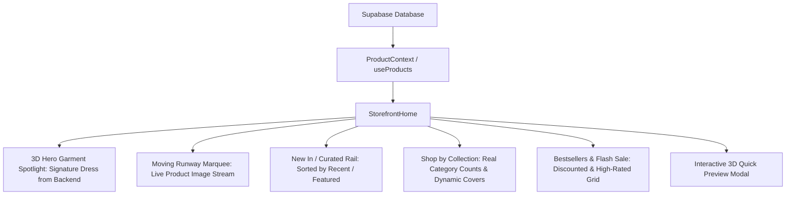

# Rosémama Homepage Redesign — V3.0 Studio Storefront Plan

## 1. Executive Summary & Goal

Transform the Rosémama storefront into a **cinematic, high-end 3D fashion website UI** inspired by modern digital ateliers (such as ThreadLab), while **preserving 100% of existing commerce, database, auth, and dashboard logic**.

Rather than dropping visitors directly into a standard product catalog or raw dashboard view, the new storefront greets users with:
- A **cinematic 3D hero experience** featuring floating, interactive dress showcases with real backend imagery and responsive 3D tilt effects.
- **Dynamic backend data synchronization** pulling live products, dresses, categories, prices, and discounts directly from Supabase / `ProductContext`.
- **Moving dress visual reels & runway marquees** that bring editorial photography to life with fluid motion and micro-interactions.
- **Zero regressions**: All existing routes, cart, checkout, profile, rewards, authentication modals, information center, and admin dashboards remain completely untouched and operational.

---

## 2. Preservation Guarantee (Strict Non-Destructive Boundary)

| System / Module | File(s) | Preservation Status & Scope |
| --- | --- | --- |
| **Routing Shell** | `src/App.tsx` (`currentPage === 'home'`) | **Only swap the rendered component for `'home'`**. All other cases (`catalog`, `product`, `cart`, `checkout`, `profile`, `rewards`, `admin`, `info`, `debug`) remain identical. |
| **Product Backend & Supabase** | `src/contexts/ProductContext.tsx`, `src/utils/supabase/client.ts` | **Untouched**. The new storefront consumes `useProducts()` directly. |
| **Cart & Guest Engine** | `src/contexts/CartContext.tsx`, `src/components/Cart.tsx` | **Untouched**. Quick-add and navigation use existing `addItem` and `useCart()`. |
| **Authentication & Profile** | `src/contexts/AuthContext.tsx`, `src/components/Profile.tsx`, `src/components/AuthModal.tsx` | **Untouched**. Auth states and modals trigger smoothly. |
| **Admin & Rewards** | `src/components/AdminDashboard.tsx`, `src/components/Rewards.tsx` | **Untouched**. Fully accessible via profile/admin route. |
| **Checkout Flow** | `src/components/Checkout.tsx` | **Untouched**. Handles guest and authenticated checkout identically. |
| **Existing Home Component** | `src/components/Home.tsx` | **Preserved in repository** as fallback/reference. |
| **Header & Footer Shells** | `src/components/Header.tsx`, `src/components/Footer.tsx` | **Enhance props only** to connect category shortcuts and smooth section scrolls without breaking search, theme toggle, or notification bells. |

---

## 3. Design Aesthetics & Visual Direction (ThreadLab Reference)

The visual direction draws directly from high-end 3D fashion studios:

1. **Atmospheric Dark Luxury & Dynamic Lighting**:
   - Deep obsidian and charcoal backdrop with subtle ambient spotlight glows (`oklch` / HSL radial gradients).
   - Glassmorphic translucent cards (`backdrop-blur-md`, subtle border highlights).
   - Sleek technical couture typography (high-contrast display headlines, uppercase tracking, coordinates metadata `51.5074° N, 0.1278° W`, "FROM SKETCH TO STUDIO-READY").

2. **Moving Dress Visuals & 3D Garment Interaction**:
   - **Interactive 3D Spotlight**: Central floating garment showcase that dynamically renders real dresses from the Supabase backend with mouse-follow 3D tilt (`perspective(1000px) rotateX/rotateY`) and ambient lighting shifts.
   - **"Try a 3D Preview" Modal**: Interactive quick-view drawer/modal with multi-angle dress inspection, colorway switcher, and 360-degree rotation feel.
   - **Infinite Moving Runway Marquee**: Smooth, GPU-accelerated horizontal ribbons of moving dress imagery pulled live from the catalog.

3. **Fluid Micro-Animations**:
   - Staggered entrance animations on scroll (`whileInView`).
   - Magnetic CTA buttons with glowing borders and directional chevron slides.
   - Interactive badge counters (Years of craftsmanship, active collections, customer satisfaction).

---

## 4. Dynamic Backend Data Flow & Integration

The storefront directly accesses `useProducts()` from `ProductContext` and derives all dynamic sections in real time:



### Data Derivation Rules:
1. **Hero Spotlight Garment**: Selected from the top featured `'Dresses'` category item in Supabase. Displays live title, ZAR price, available sizes, color dots, and direct "Add to Bag" / "Inspect in 3D".
2. **Kinetic Dress Reel**: Collects all active product image arrays into an infinite moving track.
3. **Category Hubs**: Dynamically aggregates unique categories (`Dresses`, `Casual`, `Shoes`, `Outwear`, `Party`, `Accessories`), automatically assigning the highest-resolution product image as the live category tile.
4. **Flash Sale & Bestsellers**: Filters products where `originalPrice > price` or `rating >= 4.5`, displaying South African Rand (ZAR) formatting and real discount percentages.
5. **Loading States**: Cinematic dark glass skeleton placeholders while Supabase initializes to prevent layout shifts.

---

## 5. Component Architecture

New directory: `src/components/storefront/` (modular, clean, and isolated):

```
src/components/storefront/
├── StorefrontHome.tsx                 # Master page entry combining all sections
├── sections/
│   ├── AnnouncementTicker.tsx         # Glowing marquee banner with promotion highlights
│   ├── Hero3DStudio.tsx               # 3D interactive dress spotlight, tech couture header & CTAs
│   ├── MovingDressReel.tsx            # Infinite moving runway marquee with real dress photography
│   ├── NewArrivalsRail.tsx            # Smooth Embla product carousel with touch drag gestures
│   ├── CollectionGrid.tsx             # 3D depth category cards with live backend covers & item counts
│   ├── AtelierBrandStory.tsx          # Editorial split narrative + animated counter metrics
│   ├── BestsellersSaleMatrix.tsx      # High-performance product grid with quick actions
│   ├── WhyRosemamaGrid.tsx            # 4 Glassmorphic reassurance cards with micro-interactions
│   ├── CustomerLoveTrustpilot.tsx     # Trustpilot integration + verified review highlights
│   ├── StudioNewsletter.tsx           # VIP community access form with animated state swap
│   └── Quick3DPreviewModal.tsx        # Interactive garment inspector modal (3D preview experience)
└── ui/
    ├── MotionReveal.tsx               # Reusable Framer Motion viewport reveal container
    ├── SectionHeader.tsx              # High-fashion eyebrow + title + action link component
    ├── TiltCard.tsx                   # 3D mouse-tracking interactive tilt container
    └── AnimatedCounter.tsx            # Smooth numeric spring counter for brand stats
```

---

## 6. Page Layout & User Journey

```
[Sticky Header (with Theme Toggle, Search, Cart, Account)]
 ├── 1. ANNOUNCEMENT TICKER (Free shipping over R3500 | New Atelier Drop)
 ├── 2. 3D HERO ATELIER
 │      ├── Technical Badges & Coordinates ("GLOBAL HUB FOR FASHION")
 │      ├── Bold Studio Title ("ROSÉMAMA / FROM SKETCH TO STUDIO-READY")
 │      ├── Central 3D Interactive Floating Dress (Mouse-tilt & ambient glow)
 │      └── Dual CTAs ("Explore Collection" & "Try a 3D Preview")
 ├── 3. MOVING DRESS RUNWAY REEL (Infinite smooth horizontal motion)
 ├── 4. NEW ARRIVALS CAROUSEL (Embla drag rail with enhanced ProductCards)
 ├── 5. SHOP BY COLLECTION (Interactive 3D depth cards: Dresses, Casual, Shoes, etc.)
 ├── 6. ATELIER STORY & CRAFTSMANSHIP (Editorial layout + dynamic counters)
 ├── 7. BESTSELLERS & LIMITED OFFERS (Dynamic filtered grid with instant bag add)
 ├── 8. WHY ROSÉMAMA (Free Delivery, Secure Payments, Curated Couture, 24/7 Support)
 ├── 9. VERIFIED CUSTOMER REVIEWS (Trustpilot live widget + testimonials)
 └── 10. VIP ATELIER NEWSLETTER (Sleek subscription capture + social links)
[Footer (Wired links to categories, about, shipping, chat)]
[Mobile BottomNav (Preserved)]
```

---

## 7. Interactivity & Animation Specifications

1. **Framer Motion + CSS 3D Tilt**:
   - `Hero3DStudio`: Utilizes `useMotionValue` and `useSpring` to map mouse coordinates to `rotateX` (-10deg to 10deg) and `rotateY` (-10deg to 10deg) with specular light reflections.
   - `Quick3DPreviewModal`: Allows full 360-degree garment dragging/rotating simulation with interactive garment details.
   - `MotionReveal`: Custom while-in-view wrapper with `opacity: 0, y: 30` → `opacity: 1, y: 0` using a spring ease.
   - `AnimatedCounter`: Animated numbers from 0 to target values using `useInView` and `useMotionValue`.

2. **Embla Carousel Integration**:
   - `embla-carousel-react` (already in `package.json`) drives the product rails with native touch swipe, drag momentum, and arrow navigation.

3. **Performance & Accessibility**:
   - Uses `transform` and `opacity` exclusively for GPU-accelerated 60fps animations.
   - `prefers-reduced-motion` media query support automatically disables 3D tilts and auto-scrolling for sensitive users.
   - Responsive image optimization with lazy loading.

---

## 8. Dependencies & Environment Check

- `framer-motion`: Needs installation (`npm i framer-motion`).
- `embla-carousel-react`: **Already installed** (`^8.6.0`).
- `lucide-react`: **Already installed** (`^0.487.0`).
- `clsx` & `tailwind-merge`: **Already installed**.
- React: **18.3.1** (Fully compatible).

---

## 9. Step-by-Step Implementation Roadmap

1. **Step 1: Install Dependency**
   - Run `npm i framer-motion`
2. **Step 2: Create Core UI Atoms**
   - `src/components/storefront/ui/MotionReveal.tsx`
   - `src/components/storefront/ui/SectionHeader.tsx`
   - `src/components/storefront/ui/TiltCard.tsx`
   - `src/components/storefront/ui/AnimatedCounter.tsx`
3. **Step 3: Build Interactive Sections**
   - `Hero3DStudio.tsx` & `Quick3DPreviewModal.tsx`
   - `AnnouncementTicker.tsx` & `MovingDressReel.tsx`
   - `NewArrivalsRail.tsx` & `CollectionGrid.tsx`
   - `AtelierBrandStory.tsx` & `BestsellersSaleMatrix.tsx`
   - `WhyRosemamaGrid.tsx`, `CustomerLoveTrustpilot.tsx`, `StudioNewsletter.tsx`
4. **Step 4: Compose Master Storefront**
   - `src/components/storefront/StorefrontHome.tsx` assembling all sections and connecting to `ProductContext` and `CartContext`.
5. **Step 5: Router & Header/Footer Wiring**
   - Update `src/App.tsx` `'home'` route to render `StorefrontHome`.
   - Connect `Header.tsx` and `Footer.tsx` navigation actions (`onNavigateToCategory`, section jump anchors).
6. **Step 6: Build & Runtime Verification**
   - Run `npm run build` (`tsc -p tsconfig.client.json --noEmit && vite build`) to verify type safety and zero compilation errors.
   - Validate UI in browser across desktop, tablet, and mobile viewports.

---

## 10. Verification Criteria

- [ ] **Zero Regressions**: Cart, Checkout, Auth, Admin Dashboard, Profile, and Rewards function identically.
- [ ] **Backend Data Sync**: Products, dress images, prices, categories, and stock status load dynamically from Supabase.
- [ ] **Visual WOW Factor**: 3D interactive hero garment spotlight, moving dress marquee reel, and dark luxury studio aesthetic render smoothly at 60fps.
- [ ] **Responsive Design**: Flawless layout on mobile, tablet, and ultra-wide screens, respecting mobile `BottomNav`.
- [ ] **Type Safety & Build**: Clean build with zero TypeScript or Vite errors.

---

## 11. Out of Scope (Preservation Boundaries)

- No backend / Supabase / schema changes required.
- No changes to cart, checkout, auth, orders, admin dashboard, or rewards.
- No routing library introduction (existing state-based router remains untouched).
- Old `src/components/Home.tsx` is preserved in the codebase for complete safety.

