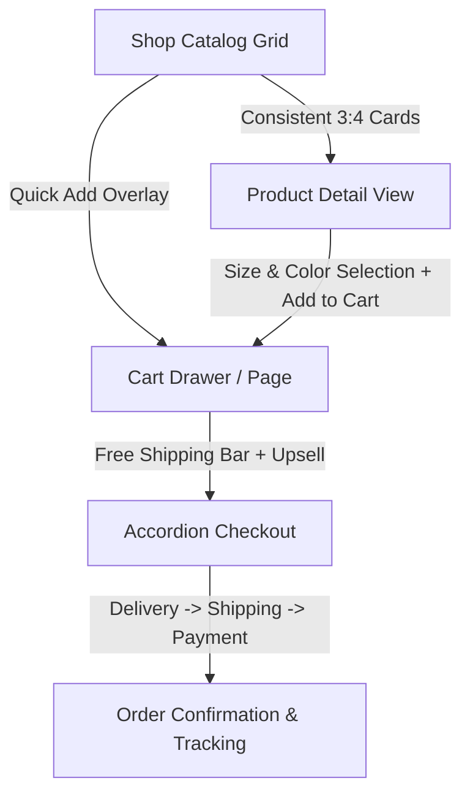

# Rosemama Clothing — Shop UI/UX & Purchase Flow Overhaul Plan

## 1. Executive Summary & Core Objectives

This blueprint outlines the complete transformation of the **Rosemama Clothing Shop UI/UX**, extending the new minimalist editorial design language across the entire e-commerce purchase funnel: **Catalog Grid → Product Detail → Cart Experience → Checkout & Order Confirmation**.

### Primary Problems Addressed
1. **Inconsistent Product Card Dimensions**: Product images currently have varying aspect ratios and heights depending on the source photography, causing jagged, misaligned rows in the shop grid.
2. **Visual Disconnect**: The catalog and product detail screens are currently trapped in a dark, clunky box aesthetic that clashes with the warm editorial theme (`#f4f1eb`) of the redesigned homepage.
3. **Friction in the Conversion Funnel**: Sizing selection, quick actions, color selection, cart upsells, and checkout progression lack modern micro-interactions and mobile ergonomics.

---

## 2. Component Architecture & End-to-End Funnel

---

## 3. Detailed Phase Breakdown

### Phase 1: Product Card Standardization & Beautification
**Files**: `src/components/ui/ProductCard.tsx`, `src/components/ui/responsive-image.tsx`, `src/styles/catalog.css`

#### 1.1 Strictly Forced 3:4 Aspect Ratio & Container Normalization
- **Container Structure**:
  - Force every card container to a strictly defined aspect ratio: `aspect-[3/4]` (or `aspect-[4/5]` for editorial look).
  - Wrapper receives fixed height constraints (`h-full`, `w-full`) with `overflow-hidden` and `rounded-[1.5rem]`.
- **Image Cropping & Alignment**:
  - Image element strictly uses `w-full h-full object-cover object-center` to automatically normalize portrait, square, and landscape vendor images without stretching or distortion.
  - Add image skeleton loader with subtle shimmer animation before images load.
  - Secondary image hover cross-fade (if `product.images.length > 1`, smoothly reveal the second photo on hover).

#### 1.2 Editorial Card Beautification
- **Floating Badge Architecture**:
  - *Top Left*: Frosted glass badge for **Sale** (`-XX%` or `SALE`), **New In**, or **Sold Out**.
  - *Top Right*: Floating round wishlist heart button with spring animation on toggle.
- **Micro-Interactions & Hover State**:
  - 1.05x image scale on card hover (`transition-transform duration-700 ease-out`).
  - Text & pricing info subtly slide up on card hover (`translate-y-1` to `translate-y-0`).
  - Quick "Add to Bag" floating button appearing on hover.
- **Card Metadata & Typography**:
  - Category pill in spaced uppercase (`0.65rem`, `letter-spacing: 0.15em`).
  - Product title in high-contrast bold typography (`font-black`, 2-line clamp).
  - Price display in bold ZAR formatting with strikethrough original price if on sale.
  - Minimalist color swatches (max 3 circles + `+N` count pill).

---

### Phase 2: Shop Catalog Experience (`ProductCatalog.tsx`)
**Files**: `src/components/ProductCatalog.tsx`, `src/styles/catalog.css`

#### 2.1 Responsive Grid Layout
- **Mobile (`<768px`)**: Pure **2-column grid** (`grid-cols-2 gap-3.5 px-3`) — eliminating the oversized 1-column layout so users can scan multiple items per viewport height.
- **Tablet (`768px - 1024px`)**: **3-column grid** (`grid-cols-3 gap-5`).
- **Desktop (`>1024px`)**: **4-column grid** (`grid-cols-4 gap-6`).

#### 2.2 Editorial Filter & Discovery Bar
- **Sticky Category Filter Pills**: Horizontal scrollable category row (`All`, `Dresses`, `Casual`, `Outwear`, `Shoes`, `Accessories`, `Sale`) with smooth pill active indicators.
- **Filter & Sort Controls**:
  - Clean pill-shaped filter trigger button with active filter counter badge.
  - Modern bottom sheet filter drawer on mobile with price slider (ZAR 0 – R5000), color multi-select, and size multi-select.
  - Custom dropdown for sorting: *Featured*, *Newest*, *Price: Low to High*, *Price: High to Low*, *Customer Rating*.
- **Empty State & Search Feedback**:
  - Elegant empty state with clear search button and suggested trending categories.

---

### Phase 3: Product Detail Experience (`ProductDetail.tsx`)
**Files**: `src/components/ProductDetail.tsx`, `src/styles/product-detail.css`

#### 3.1 Media Presentation
- **Hero Image Gallery**:
  - Left column: Large 3:4 aspect-ratio hero frame with zoom capability.
  - Thumbnail row: Interactive thumbnail strip with active border indicator.
  - Mobile swipeable carousel with pagination dots.

#### 3.2 Product Options & Selection Ergonomics
- **Size Selector**:
  - Minimalist pill buttons (`XS`, `S`, `M`, `L`, `XL`, `XXL`, `40`, `42`) with clean active states (`bg-[#111] text-white`).
  - Strikethrough and disabled state for out-of-stock sizes.
  - Integrated "Size Guide" modal with fit description chart.
- **Color Selector**:
  - Color swatches with border rings and selected color name label.
- **Quantity Selector**:
  - Rounded pill stepper (`-` / count / `+`) with automatic limit checks.

#### 3.3 Mobile Sticky Buy Bar & Trust Badges
- **Mobile Sticky Action Bar**:
  - Fixed floating pill bar at bottom of mobile viewport: Product price + "Add to Cart" button + Wishlist heart.
  - Safe-area bottom padding integration so it never conflicts with bottom navigation.
- **Information Accordion**:
  - Collapsible panels: *Description*, *Fabric & Care Instructions*, *Shipping & Delivery (Free over R3500)*, *Easy 72hr Returns*, *Trustpilot Verified Reviews*.

---

### Phase 4: Cart & Purchase Completion Flow (`Cart.tsx`, `Checkout.tsx`)
**Files**: `src/components/Cart.tsx`, `src/components/Checkout.tsx`, `src/styles/cart.css`

#### 4.1 Frictionless Cart Experience
- **Free Shipping Progress Meter**:
  - Visual progress bar: *"Add R450 more to unlock Free Nationwide Delivery (R3,500 threshold)"*.
- **Cart Line Items**:
  - Compact 3:4 thumbnail, title, selected size & color, unit price, inline quantity stepper, and trash icon.
- **Promo & Rewards Integration**:
  - 1-click promo code input with instant discount calculation.
  - Loyalty rewards point redemption toggle for registered members.
- **Cross-sell Carousel ("Complete The Look")**:
  - Recommended accessory / complementary piece with 1-tap quick add.

#### 4.2 Streamlined 3-Step Accordion Checkout
- **Step 1: Delivery Details**: Address autocomplete, recipient phone number for courier updates.
- **Step 2: Shipping Method**: Standard Courier (R110 / Free over R3500) vs Express Overnight.
- **Step 3: Secure Payment**: PayFast / Card / Instant EFT / Ozow / Apple Pay integration with 256-bit encryption guarantee.
- **Order Summary Card**: Sticky summary with subtotal, discounts, shipping, VAT, and final total.

---

## 4. Visual Comparison: Before vs After

| Feature | Current State | Redesigned Standard |
| :--- | :--- | :--- |
| **Catalog Grid Card Height** | Uneven heights, images stretched or cropped randomly | Uniform 3:4 aspect ratio across all cards with `object-cover` |
| **Mobile Grid Layout** | 1 large card per row (excessive scrolling) | Clean 2-column grid with balanced whitespace |
| **Color Theme** | Heavy dark backgrounds (`#1a0b2e`) | Warm editorial aesthetic (`#f4f1eb`, `#111`, `#fff`) |
| **Product Detail Selectors** | Bulky dark rectangular boxes | Sleek frosted pills & rounded interactive swatches |
| **Cart & Buy Actions** | Standard static form buttons | Sticky mobile CTA pill + Free Shipping progress bar |

---

## 5. Implementation Roadmap & Milestones

1. **Milestone 1**: Implement `ProductCard.tsx` aspect-ratio normalization and editorial typography.
2. **Milestone 2**: Overhaul `ProductCatalog.tsx` with 2-column mobile grid, sticky filter pills, and bottom sheet filter drawer.
3. **Milestone 3**: Redesign `ProductDetail.tsx` with media gallery, size/color selectors, and sticky mobile purchase bar.
4. **Milestone 4**: Polish `Cart.tsx` and `Checkout.tsx` with free shipping tracker, coupon engine, and clean order breakdown.
5. **Milestone 5**: Cross-device testing (Mobile, Tablet, Desktop) and performance optimization.
